# jobseekr

A self-hosted job application tracker.
Keep every application in one place: the company, the posting link, the exact CV and cover letter you sent, where it stands, and when to follow up.
Your data stays on your own server.

jobseekr is a small Django and PostgreSQL app that runs with Docker Compose.
It has no tracking, no third-party services and no public sign-up.

## Features

- **Applications** with company, role, posting URL, location and work mode, status, date applied, salary notes, contact person, source, next follow-up date and free-form notes.
- **Status pipeline:** wishlist, applied, interviewing, offer, rejected, withdrawn, no response.
- **History per application.** Creation, status changes and edits that change recorded fields are logged with a timestamp, and you can add your own updates (for example "Sent a follow-up email") together with a new follow-up date.
  Rejected, withdrawn and no-response applications clear their follow-up date and ignore follow-up dates submitted with notes.
  Saving a non-wishlist application or changing its status away from wishlist fills a blank applied date with today; an existing applied date is preserved.
- **Documents.** Upload the exact CV and cover letter (PDF or DOCX) sent with each application, or reuse one you uploaded before.
  Documents are never edited in place: a new version is a new upload, so every application keeps pointing at the file that was actually sent.
  The Documents page shows which applications each file went to.
- **Private files.** Uploads are stored outside the static files and are only served through a login-protected view.
  There is no public media URL.
- **Overview** with status filters, search (company, role, location, contact, source, notes) and sorting.
- **Needs attention.** Open applications whose follow-up date has arrived, and applied, interviewing or offer applications with no logged activity for `STALE_AFTER_DAYS` (14 by default), are listed at the top of the overview.
  Quiet applications with a future follow-up date are omitted until that date arrives.
- **Paste a link to capture a posting.** Paste a posting URL on the overview and jobseekr fetches the page and fills in the role, company, location, source, salary (when the ad states one) and a copy of the ad text.
  Nothing is saved until you review the form and save it.
  The "Fetch details" button next to the URL field does the same on the new and edit forms, filling only fields that are still empty.
  If the page cannot be fetched or has no job details, the form says why and you fill it in yourself.
  jobseekr also warns when you already track the same posting URL.
  Type a company name to pick an existing company or create a new one inline.
  Capture works best with LinkedIn, Jobindex, The Hub, Teamtailor and Emply pages, and falls back to schema.org job data and page metadata for other sites.
- **Copy of the job ad.** The ad text is kept with the application, so you can still read what you applied for after the posting is taken down.
  It is filled in by link capture, or you can paste it yourself.
  Applications without a copy offer a "Fetch a copy from the posting" link while the posting is still up.
- **Follow-ups.** The Follow-ups page lists overdue, due-today and gone-quiet applications, then upcoming follow-ups.
  "Done" logs that you followed up and clears the date.
  "Snooze" adds 1, 3, 7 or 14 days to the later of today and the existing follow-up date, so it never brings a reminder forward.
  Both are recorded in the application's history and are also available in the overview's "Needs attention" panel.
  The navigation shows how many reminders need attention.
- **Weekly summary.** The Summary page shows a week's applications, responses (interview invitations, offers and rejections) and interviews, plus follow-ups due, follow-ups coming up in the next 7 days and applications that have gone quiet.
  Follow-ups and quiet applications reflect the current day, even when viewing a past week's activity.
  The same summary can be e-mailed once a week; see [Weekly summary e-mail](#weekly-summary-e-mail).

Out of scope: job-board scraping, e-mail ingestion and anything that needs a public sign-up page.
Accounts are created by the administrator, and every page requires a login.
The one exception is the optional [public demo](#public-demo-mode), where each visitor gets a private sandbox account.
Each account sees only its own companies, documents and applications, so one instance can serve a household with separate logins.

## Screenshots

Taken from the [public demo](#public-demo-mode), so every company, person and address in them is fictional.
The pages follow the system light or dark setting; GitHub shows the one that matches yours.

### Overview

Applications with a needs-attention panel and a paste-a-link box.
The demo offers five sample links.

<picture>
  <source media="(prefers-color-scheme: dark)" srcset="docs/screenshots/overview-desktop-dark.png">
  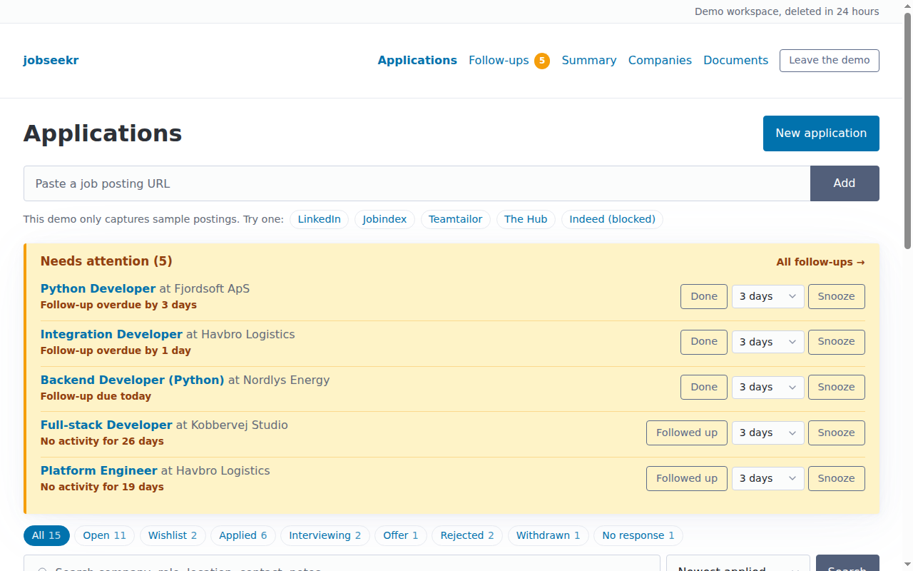
</picture>

### Capture from a posting

A sample posting fills in the role, company, location, source and a copy of the ad.
Nothing is saved until you do.

<picture>
  <source media="(prefers-color-scheme: dark)" srcset="docs/screenshots/capture-desktop-dark.png">
  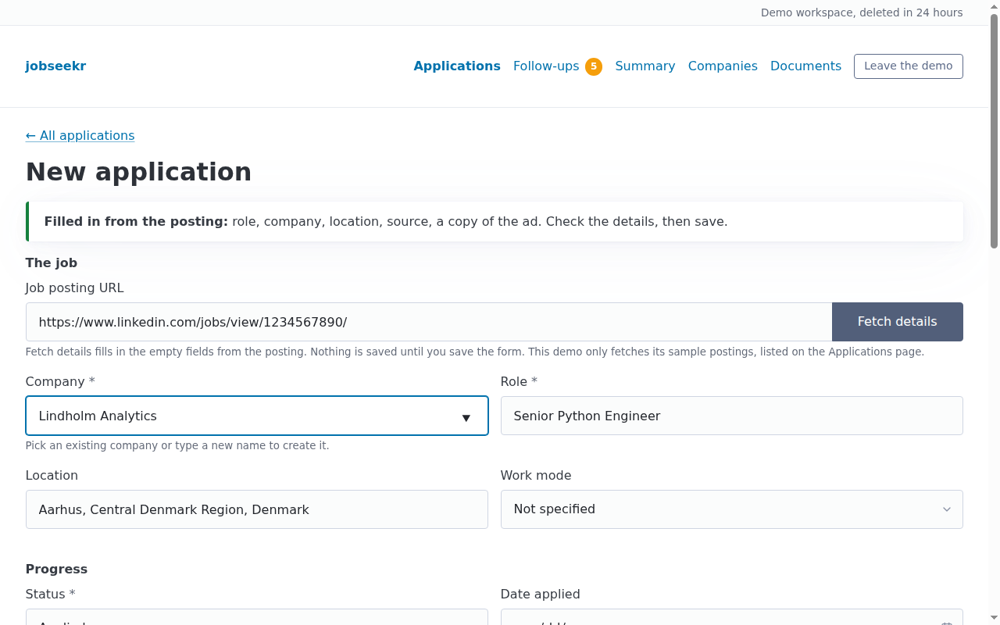
</picture>

### Application detail

Status, contact, the exact CV and cover letter sent, and a history of every change.

<picture>
  <source media="(prefers-color-scheme: dark)" srcset="docs/screenshots/application-desktop-dark.png">
  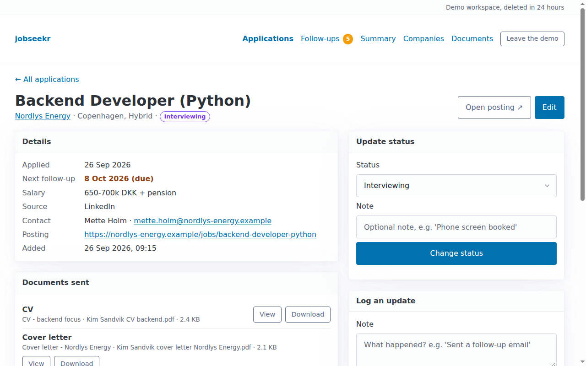
</picture>

### Follow-ups

Overdue, due today, gone quiet and coming up, each with Done and Snooze.

<picture>
  <source media="(prefers-color-scheme: dark)" srcset="docs/screenshots/follow-ups-desktop-dark.png">
  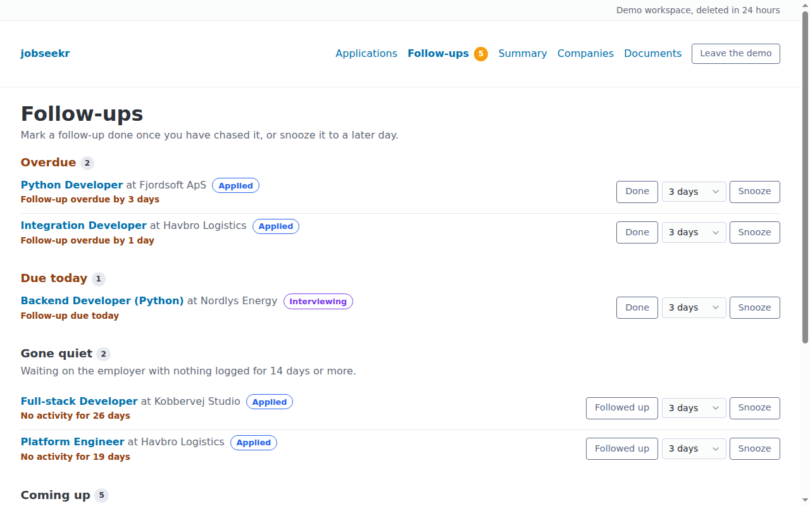
</picture>

### Weekly summary

A week of applications, responses and interviews, plus follow-ups due right now.

<picture>
  <source media="(prefers-color-scheme: dark)" srcset="docs/screenshots/summary-desktop-dark.png">
  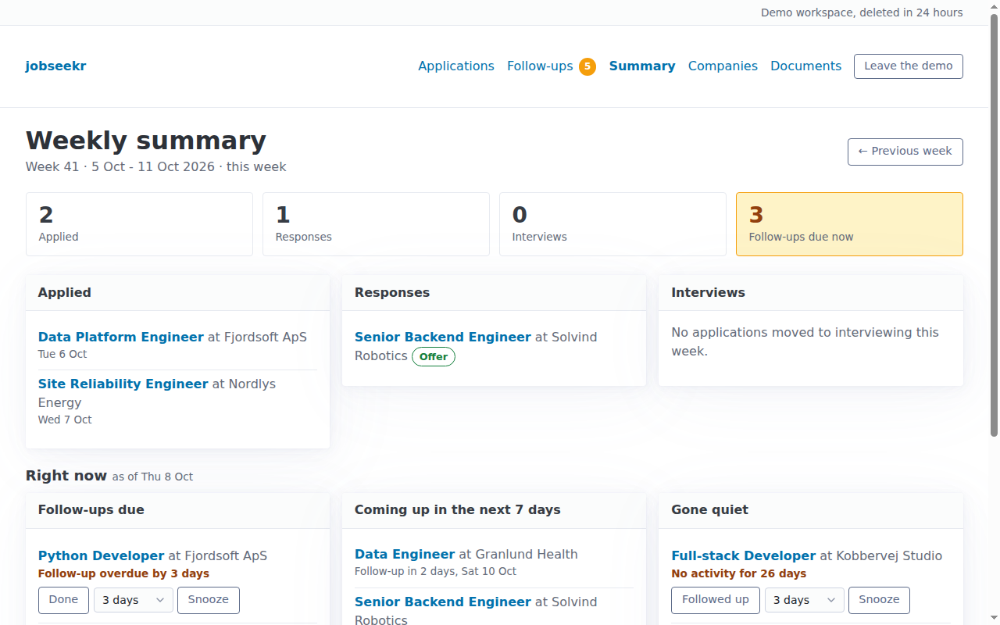
</picture>

### Try page

What the public demo is, before a visitor gets a private sandbox.

<picture>
  <source media="(prefers-color-scheme: dark)" srcset="docs/screenshots/try-desktop-dark.png">
  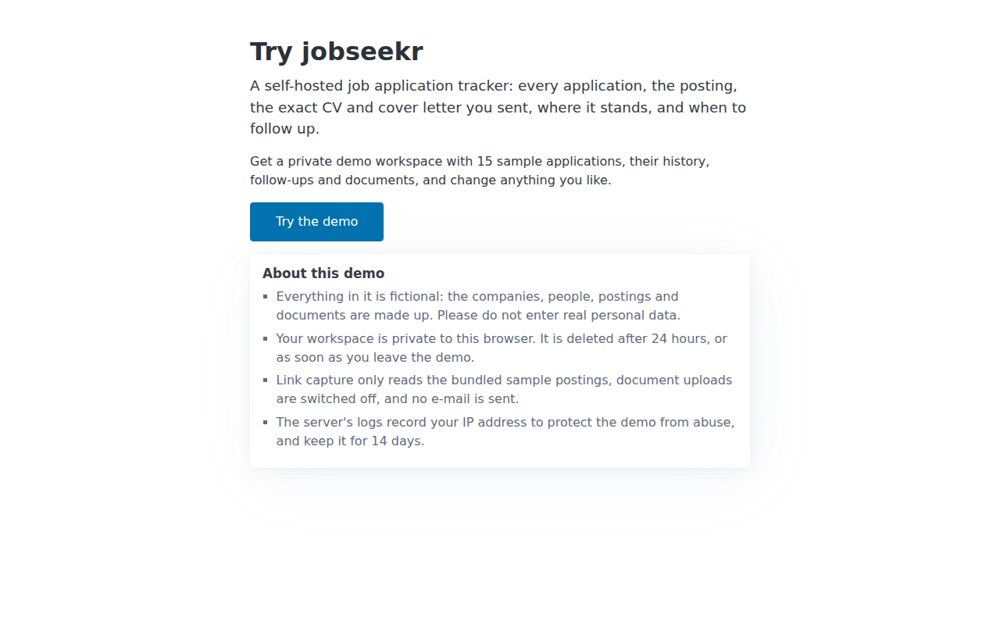
</picture>

### On a phone

Every page works at phone width.

<p>
<picture>
  <source media="(prefers-color-scheme: dark)" srcset="docs/screenshots/overview-phone-dark.png">
  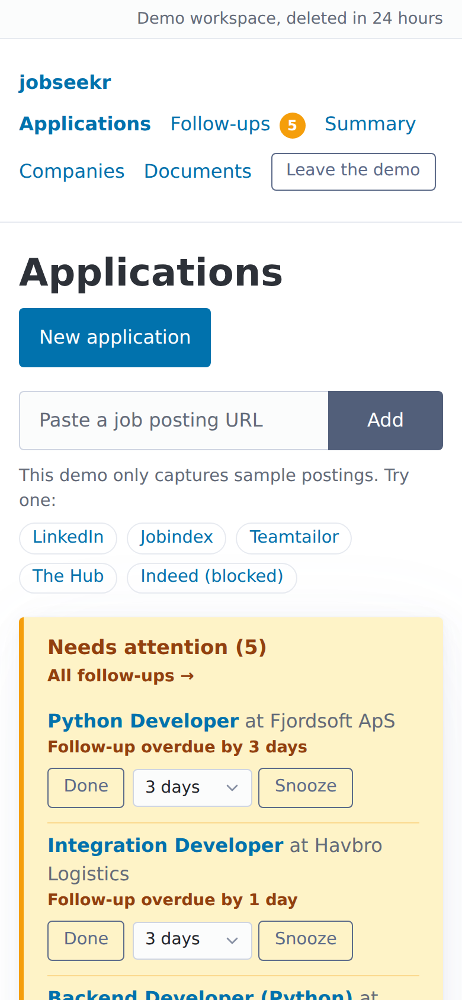
</picture>
<picture>
  <source media="(prefers-color-scheme: dark)" srcset="docs/screenshots/capture-phone-dark.png">
  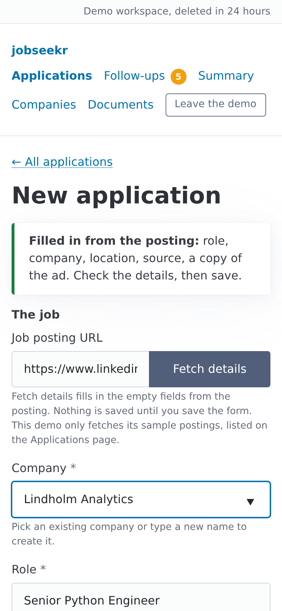
</picture>
<picture>
  <source media="(prefers-color-scheme: dark)" srcset="docs/screenshots/application-phone-dark.png">
  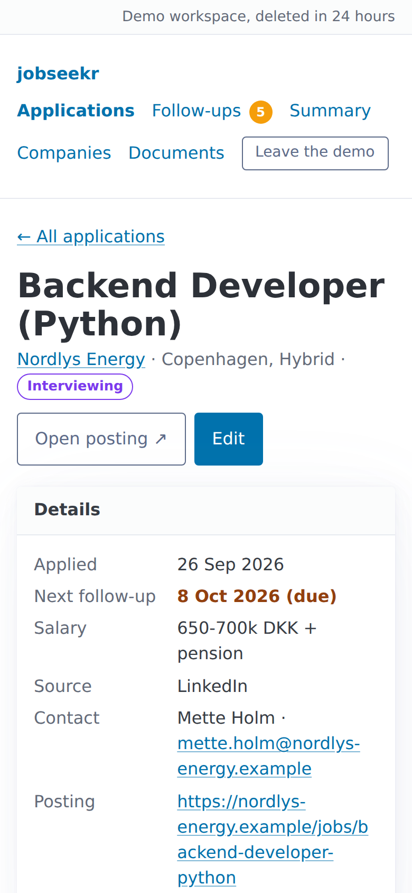
</picture>
<picture>
  <source media="(prefers-color-scheme: dark)" srcset="docs/screenshots/follow-ups-phone-dark.png">
  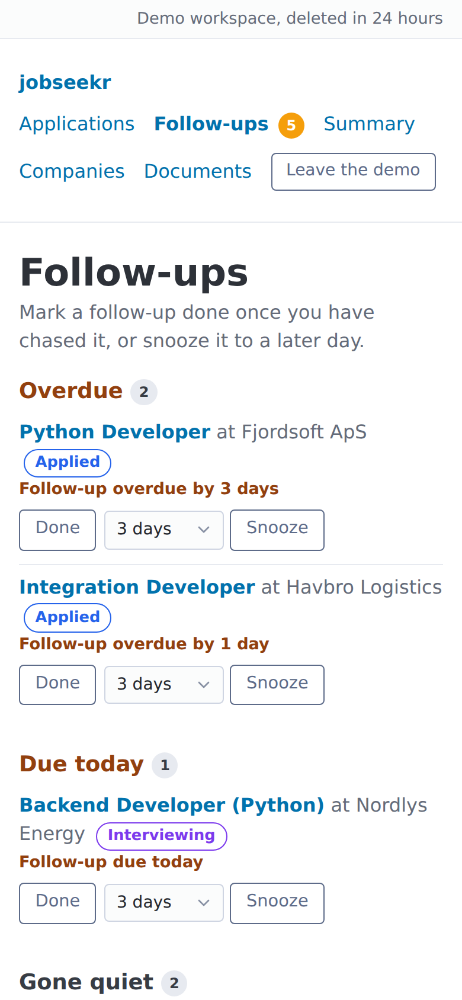
</picture>
<picture>
  <source media="(prefers-color-scheme: dark)" srcset="docs/screenshots/summary-phone-dark.png">
  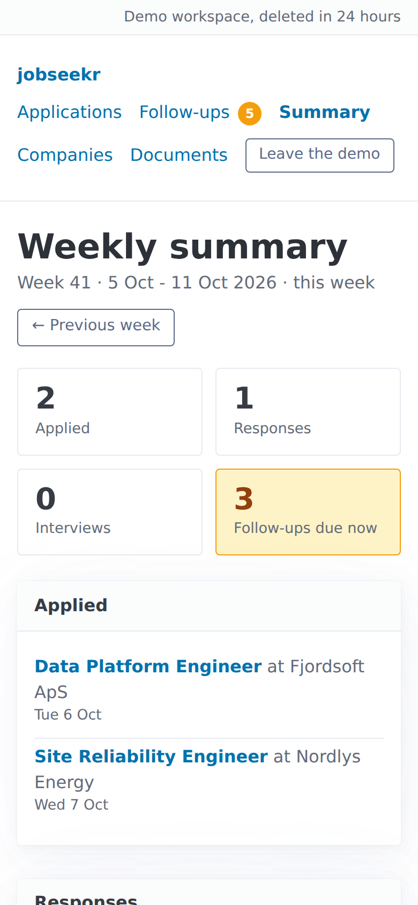
</picture>
<picture>
  <source media="(prefers-color-scheme: dark)" srcset="docs/screenshots/try-phone-dark.png">
  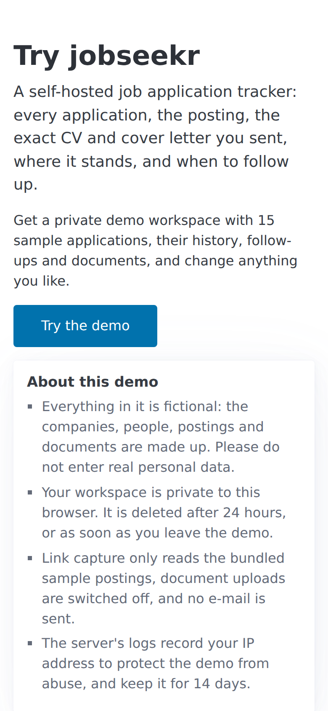
</picture>
</p>

## Quickstart

You need Docker with the Compose plugin.

```sh
git clone https://github.com/adrianprofir/jobseekr.git
cd jobseekr
cp .env.example .env
```

Edit `.env` and set at least:

- `DJANGO_SECRET_KEY`: a long random value, for example from `python3 -c "import secrets; print(secrets.token_urlsafe(50))"`.
- `POSTGRES_PASSWORD`: a strong password. It is only used inside the Compose network.
- `TIME_ZONE`: your time zone, for example `Europe/Copenhagen`.

Then build and start the stack and create your login:

```sh
docker compose up -d --build
docker compose exec web python manage.py createsuperuser
```

Open http://localhost:8000 and log in.

The defaults publish the app on `127.0.0.1` only, so it is reachable from the machine it runs on.
To use it from other devices, see [Network access](#network-access).

## Network access

jobseekr is designed for a trusted network: your own machine, a home or office LAN, or a private overlay network such as a tailnet or a VPN.
It has no public sign-up and it has not been hardened for open internet exposure.
If you put it on the internet anyway, terminate HTTPS in a reverse proxy and read [SECURITY.md](SECURITY.md) first.

To reach the app from your network, set these in `.env`:

- `BIND_ADDRESS`: the server's own address on that network, for example `192.0.2.10`. The web container is published only on this address. If it is unset, Compose binds to `127.0.0.1`. Never use `0.0.0.0`.
- `WEB_PORT`: the port on that address (default `8000`).
- `DJANGO_ALLOWED_HOSTS` and `DJANGO_CSRF_TRUSTED_ORIGINS`: the host names or IPs, and full origins such as `http://192.0.2.10:8000`, you use in the browser.

Then run `docker compose up -d`.

### Behind a reverse proxy with HTTPS

If a reverse proxy terminates HTTPS in front of the app, add the following to `.env`:

```sh
DJANGO_SECURE_COOKIES=true
TRUST_X_FORWARDED_PROTO=true     # only if the proxy always sets X-Forwarded-Proto
SECURE_SSL_REDIRECT=true
SECURE_HSTS_SECONDS=31536000     # start low (for example 300) until you are sure HTTPS works
DJANGO_ALLOWED_HOSTS=jobs.example
DJANGO_CSRF_TRUSTED_ORIGINS=https://jobs.example
```

The `/healthz` endpoint is exempt from the HTTPS redirect, so the container health check keeps working.

### Tailscale and a worked home-server example

[docs/deploy-home-server.md](docs/deploy-home-server.md) walks through a complete home-server setup as one worked example: a LAN listener, an optional Tailscale relay that cannot take the LAN listener down at boot, scheduled backups and the weekly summary cron job.

## Day-to-day operation

Check health and logs with:

```sh
docker compose ps        # both services should be "healthy"
docker compose logs -f web
```

The web container's health check calls `/healthz`, which does not require a login and only reports whether the database is reachable.

Django's `/admin/` interface manages accounts and permissions only.
Manage companies, applications and documents through the tracker pages.

To give someone else their own tracker, add an account for them in `/admin/`.
Every company, document and application belongs to the account that created it; other accounts cannot see or open it.
Deleting an account deletes its companies, documents and applications, and the stored document files.

### Link capture and outbound requests

Link capture is the only feature that makes the server fetch anything from the internet.
The request comes from your server, so the job site sees the server's public IP address, not your browser.
Only `http` and `https` links to public internet addresses are fetched: links that resolve to private, loopback, link-local, carrier-grade NAT (including Tailscale) or other non-public addresses are refused, and so are redirects to them.
Each fetch is limited to 20 seconds and 3 MB, follows at most 5 redirects and accepts only HTML.
Some job boards, Indeed in particular, block automated requests; the form then says so and you fill it in yourself.
Each capture is logged with the URL and its outcome.

### Weekly summary e-mail

The e-mail is optional and off unless `EMAIL_HOST` is set.
Each account gets its own summary, sent to the e-mail address on the account; accounts without one get none.
Set the SMTP settings in `.env` (see the [configuration reference](#configuration-reference)), add your e-mail address to your account in `/admin/`, restart the stack with `docker compose up -d`, and check the result without sending anything:

```sh
docker compose exec web python manage.py send_weekly_summary --dry-run
```

Then schedule the command on the server.
By default it summarises the week (Monday to Sunday) that contains yesterday, so run it on Sunday evening or Monday morning:

```cron
0 8 * * 1 cd /opt/jobseekr && docker compose exec -T web python manage.py send_weekly_summary >> /var/log/jobseekr-summary.log 2>&1
```

The command logs every send and exits with an error if sending to any account fails, or if no account has an e-mail address, so cron or your log monitoring can alert on it.
Without `EMAIL_HOST` it logs that it skipped sending and exits successfully.
`--week 2026-W40` sends a specific week, and `--user <username>` sends only that account's summary.

### Data

Two named volumes hold everything that matters:

| Volume | Contents |
| --- | --- |
| `jobseekr_postgres-data` | The PostgreSQL database. |
| `jobseekr_documents` | Uploaded CVs and cover letters. |

`docker compose down` keeps both volumes.
`docker compose down -v` deletes them, and with them all your data.

### Upgrading

```sh
git pull
docker compose up -d --build
```

Migrations run automatically on start.
Take a backup first.

#### Upgrading a stack created as `job-tracker`

The project was called job-tracker before it was renamed to jobseekr, and the Compose project name (`name:` in `compose.yaml`) became `jobseekr`.
Compose derives volume names from the project name, so an existing stack created under the old name would start with new, empty volumes and look empty.
To keep using the old volumes, pin the old project name before you deploy the renamed code.
Add this line to `.env`:

```sh
COMPOSE_PROJECT_NAME=job-tracker
```

Then confirm that Compose resolves the old name and sees the old volumes, before starting anything:

```sh
docker compose config | grep '^name:'     # name: job-tracker
docker volume ls | grep job-tracker       # job-tracker_postgres-data, job-tracker_documents
```

Then run `docker compose up -d --build` as usual.
`COMPOSE_PROJECT_NAME` takes precedence over `name:` in `compose.yaml`.
Fresh installs do not need it.

#### Upgrading from a version without separate accounts

The upgrade gives all existing companies, documents and applications to your account.
That migration needs exactly one account to exist, and otherwise stops the web container with a message in `docker compose logs web`.
With no account, create one without running the migrations first, then start the stack again:

```sh
docker compose run --rm --entrypoint python web manage.py createsuperuser
```

With several accounts, the message lists them: set `EXISTING_DATA_OWNER` in `.env` to the username that should own the data, then start the stack again.
The weekly summary now goes to the e-mail address on your account instead of `WEEKLY_SUMMARY_TO`, so add the address in `/admin/` and remove `WEEKLY_SUMMARY_TO` from `.env`.

### Backups

`scripts/backup.sh` dumps the database and archives the uploaded documents from the running stack:

```sh
scripts/backup.sh                  # writes backups/<timestamp>/
scripts/backup.sh /srv/backups/jobseekr   # or any other directory
```

The script stops the web service while copying both parts and always attempts to start it again on exit, including after a failure.
The app is unavailable during backup.

Each backup directory contains `db.dump` (a PostgreSQL custom-format dump) and `documents.tar.gz`.
The script exits with an error if dumping or archiving fails, the database dump is empty, or the documents archive fails gzip integrity validation.
It does not validate the database dump's contents during backup.
Run it from cron and alert on failure, for example:

```cron
30 3 * * * cd /opt/jobseekr && scripts/backup.sh /srv/backups/jobseekr >> /var/log/jobseekr-backup.log 2>&1
```

Keep copies off the server; the backups contain your CVs and personal data.

### Restore

With the stack running, restore a backup directory (this replaces the current database and documents):

```sh
scripts/restore.sh backups/20261004-093000 --force
```

The script stops the web service, reads the full database dump and extracts the documents archive into a temporary directory before replacing any live data.
It then restores the database with `pg_restore --clean` and replaces the documents volume contents from the verified extraction.
It always attempts to start the web service again on exit, including after a failure.
The app is unavailable during restore.

## Public demo mode

`DEMO_MODE=true` turns an instance into a public demo that anyone can try without an account.
It is meant for a dedicated demo deployment with its own database, never for an instance that holds real data.

- **Try the demo.** A visitor without a session lands on `/try/`, which says what the demo is and what happens to the data.
  "Try the demo" creates a sandbox account with a random username (`demo-` and eight hex digits) and no usable password, fills it with sample data and signs the browser in.
  Only that browser can ever use it.
  Pressing it again while signed in goes back to the same workspace.
- **Sample data.** Each sandbox gets fifteen applications at fictional companies across every status, with contacts on `.example` addresses, a history for each, follow-ups that are overdue, due today, gone quiet and coming up, and three generated sample PDFs (two CVs and a cover letter) for a fictional person.
  Dates are relative to the day the sandbox is made.
  The bundle is `demo/seed.py`.
- **Private to each visitor.** A sandbox is an ordinary account, so the per-account scoping keeps visitors from seeing each other's data.
- **Leaving and expiry.** "Leave the demo" replaces "Log out": it signs out and deletes the workspace at once.
  A sandbox is deleted `SANDBOX_LIFETIME_HOURS` (24) after it was made; a visitor who comes back later is sent to `/try/?expired=1`, which says so.
  `manage.py expire_sandboxes` deletes expired sandboxes, and `--all` deletes every one.
- **Limits.** At most `SANDBOX_MAX_ACTIVE` (100) sandboxes exist at once, and one visitor address may start `SANDBOX_RATE_LIMIT` (3) in `SANDBOX_RATE_WINDOW` seconds (3600).
  Beyond either, the Try page answers 503 or 429 with `Retry-After` and a sentence that says what happened.
  A left sandbox still counts toward the rate limit until it expires.
  The address comes from the `CLIENT_IP_HEADER` request header when it is set (for example `CF-Connecting-IP` behind Cloudflare), else from the connection; an address that does not parse counts as unknown.
  A rate limit at the edge belongs in front of it as well.
  Each sandbox holds at most `SANDBOX_MAX_APPLICATIONS` (200) applications and `SANDBOX_MAX_COMPANIES` (100) companies, notes and the copy of the ad have length limits, and request bodies are limited to 512 KB.
- **No outbound requests.** Link capture runs with `CAPTURE_MODE=samples`: the overview offers five sample links (LinkedIn, Jobindex, Teamtailor and The Hub style pages, and an Indeed link that shows what happens when a board blocks the request), answered from the synthetic pages in `tracker/capture/postings/`.
  Any other link is refused without being fetched, and can still be saved by hand.
- **No uploads.** `DOCUMENT_UPLOADS_ENABLED=false`: the upload page explains why, the forms have no file fields, and files in a request are skipped without being stored.
  The sample documents stay viewable and downloadable.
- **No e-mail.** The app refuses to start with `DEMO_MODE` on and `EMAIL_HOST` set, and also with `CAPTURE_MODE=live` or `DOCUMENT_UPLOADS_ENABLED=true`.
- **Logging.** Creating, refusing, leaving and expiring a sandbox are logged by `demo.sandboxes` with the visitor's address.
  The Try page states that the logs keep the address for `DEMO_LOG_RETENTION_DAYS` (14) days; set it to match your log retention.
- **Housekeeping.** Run the `scheduler` service, which deletes expired sandboxes and expired sessions every 5 minutes (`SCHEDULER_INTERVAL_SECONDS`):

  ```sh
  docker compose --profile demo up -d
  ```

- **Link back.** `MAIN_SITE_URL` adds a slim strip on top of every page that links back to the site the demo is shown on.
  It is empty by default, which shows no strip, and works without demo mode too.
- **Hosting one.** [docs/demo.md](docs/demo.md) describes a ready-made Compose stack in `deploy/demo/` for a reverse proxy or tunnel, with its smoke test.

The Django admin lists the sandboxes read-only, and `/admin/` and `/login/` still work for the operator's own account.

## Configuration reference

All settings come from environment variables; see `.env.example` for defaults and comments.

| Variable | Purpose |
| --- | --- |
| `DJANGO_SECRET_KEY` | Required unless `DJANGO_DEBUG=true`. |
| `DJANGO_DEBUG` | `true` only for local development. |
| `DJANGO_ALLOWED_HOSTS` | Comma-separated host names or IPs (`localhost` and `127.0.0.1` are always allowed). |
| `DJANGO_CSRF_TRUSTED_ORIGINS` | Comma-separated origins used in the browser. |
| `DJANGO_SECURE_COOKIES` | `true` only if the app is served over HTTPS. |
| `TRUST_X_FORWARDED_PROTO` | `true` to trust a reverse proxy's `X-Forwarded-Proto` header. Only if the proxy always sets it. Off by default. |
| `SECURE_SSL_REDIRECT` | `true` to redirect plain HTTP to HTTPS (`/healthz` is exempt). Off by default. |
| `SECURE_HSTS_SECONDS`, `SECURE_HSTS_INCLUDE_SUBDOMAINS`, `SECURE_HSTS_PRELOAD` | HTTP Strict Transport Security. Off by default (`0`). |
| `TIME_ZONE` | Time zone for dates and reminders (default `UTC`). |
| `LOG_LEVEL` | Log level for the app logs written to stdout. |
| `POSTGRES_DB`, `POSTGRES_USER`, `POSTGRES_PASSWORD`, `POSTGRES_HOST`, `POSTGRES_PORT` | Database connection. Compose sets the host and port itself. |
| `PRIVATE_MEDIA_ROOT` | Where uploaded documents are stored. Compose uses the documents volume. |
| `DOCUMENT_MAX_UPLOAD_MB` | Maximum size of an uploaded document (default 15). |
| `STALE_AFTER_DAYS` | Days without activity before an application waiting on the employer is flagged (default 14). |
| `SOURCE_SUGGESTIONS` | Comma-separated sources suggested in the application form. Defaults to `LinkedIn,Company website,Referral,Recruiter,Jobindex`. Sources already in use are always offered as well. Set it empty to suggest none. |
| `EMAIL_HOST` | SMTP server for the weekly summary e-mail. Leave empty to turn the e-mail off. |
| `EMAIL_PORT` | SMTP port. Defaults to 587 with STARTTLS, 465 with `EMAIL_USE_SSL`, otherwise 25. |
| `EMAIL_HOST_USER`, `EMAIL_HOST_PASSWORD` | SMTP login, if the server needs one. |
| `EMAIL_USE_TLS`, `EMAIL_USE_SSL` | STARTTLS (the default) or implicit TLS. Set `EMAIL_USE_SSL=true` for port 465. |
| `DEFAULT_FROM_EMAIL` | Sender address. Defaults to `EMAIL_HOST_USER`, or `jobseekr@localhost` when no SMTP user is set. |
| `SITE_URL` | The address you open the app on, for example `http://localhost:8000`, so the e-mail can link to it. Optional. |
| `BIND_ADDRESS`, `WEB_PORT` | Compose only: host address and port the app is published on (defaults `127.0.0.1` and `8000`). |
| `COMPOSE_PROJECT_NAME` | Compose only: pins the project name, and so the volume names, of a stack created under an older name. See [Upgrading](#upgrading-a-stack-created-as-job-tracker). |
| `DEMO_MODE` | `true` for a [public demo](#public-demo-mode) with a private sandbox per visitor. Off by default. |
| `CAPTURE_MODE` | `live` (the default) fetches pasted posting links; `samples` fetches nothing and only answers the bundled sample postings. Defaults to `samples` in demo mode, which requires it. |
| `DOCUMENT_UPLOADS_ENABLED` | `false` switches document uploads off; stored documents stay downloadable. Defaults to `false` in demo mode, which requires it. |
| `SANDBOX_LIFETIME_HOURS`, `SANDBOX_MAX_ACTIVE` | Demo only: hours before a sandbox is deleted (24), and how many may exist at once (100). |
| `SANDBOX_RATE_LIMIT`, `SANDBOX_RATE_WINDOW` | Demo only: sandboxes one visitor address may start (3) per window in seconds (3600). |
| `SANDBOX_MAX_APPLICATIONS`, `SANDBOX_MAX_COMPANIES` | Demo only: what one sandbox may hold (200 applications, 100 companies). |
| `CLIENT_IP_HEADER` | Demo only: the request header holding the visitor's address, such as `CF-Connecting-IP`. Set it only behind a proxy that always sets it. Empty by default, which uses the connection's address. |
| `DEMO_LOG_RETENTION_DAYS` | Demo only: how long your logs keep visitor addresses, as stated on the Try page (14). |
| `MAIN_SITE_URL` | A site to link back to from a strip on top of every page. Empty by default (no strip). |
| `SCHEDULER_INTERVAL_SECONDS` | Compose `scheduler` service only: seconds between housekeeping runs (300). |
| `EXISTING_DATA_OWNER` | Only read by the upgrade that introduced separate accounts, when more than one account exists: the username that gets the existing data. See [Upgrading](#upgrading-from-a-version-without-separate-accounts). |

## Tech stack

- Django 6.1 and PostgreSQL 18, Python 3.14.
- Server-rendered templates styled with [Pico CSS](https://picocss.com), vendored in `static/vendor/pico` so the app works without internet access (see [THIRD_PARTY_NOTICES.md](THIRD_PARTY_NOTICES.md)).
- Gunicorn and WhiteNoise in production, run with Docker Compose.
- [uv](https://docs.astral.sh/uv/) for dependencies, pytest for tests, Ruff for lint and formatting.

## Project layout

| Path | What it is |
| --- | --- |
| `config/` | Django settings (all from environment variables), URLs and WSGI entry point. |
| `tracker/` | The app: models, forms, views, templates and tests. |
| `tracker/capture/` | Link capture: the guarded page fetcher, the job posting extractor and the demo's sample postings. |
| `tracker/summary.py`, `tracker/reminders.py` | The weekly summary and the follow-up reminder lists. |
| `tracker/capture/postings/` | Synthetic job posting pages: the capture tests run against them, and the demo serves some as sample links. |
| `templates/` | Site-wide base and login templates. |
| `static/` | Site CSS and vendored Pico CSS. |
| `demo/` | The public demo: the Try page, sandboxes with their limits and expiry, the seed bundle and its PDF writer, `expire_sandboxes`. |
| `docker/entrypoint.sh` | Applies migrations, then starts gunicorn. |
| `docker/scheduler.sh` | The demo's housekeeping loop run by the `scheduler` service. |
| `compose.yaml`, `Dockerfile` | The Docker Compose deployment. |
| `deploy/` | Optional Compose overrides, such as the Tailscale relay. |
| `deploy/demo/` | A self-contained public-demo stack with its smoke test. |
| `docs/demo.md` | Running the public demo behind a proxy or tunnel. |
| `docs/screenshots/` | The README screenshots, taken from a demo sandbox. |
| `docs/deploy-home-server.md` | A worked home-server deployment. |
| `scripts/backup.sh`, `scripts/restore.sh` | Backup and restore of the database and documents. |

## Contributing

Bug reports, ideas and pull requests are welcome.
See [CONTRIBUTING.md](CONTRIBUTING.md) for the development setup, the checks CI runs and how to add support for another job board.
Please report security problems privately, as described in [SECURITY.md](SECURITY.md).

## Licence

[MIT](LICENSE).
Third-party notices are in [THIRD_PARTY_NOTICES.md](THIRD_PARTY_NOTICES.md).
